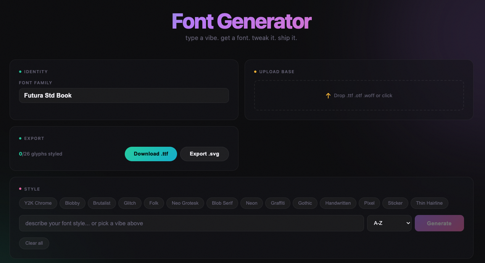

# AI Font Generator

**type a vibe. get a font. tweak it. ship it.**



AI Font Generator — это веб-приложение, которое превращает текстовое описание стиля в полноценный шрифт. Опишите настроение — и ИИ сгенерирует уникальные глифы, которые можно настроить, отредактировать и скачать как `.ttf` файл.

---

## Возможности

### Генерация шрифтов через ИИ
- Введите описание стиля на естественном языке (например, "Y2K metallic chrome", "brutalist geometric", "handwritten ink")
- **14 пресетов** на любой вкус: Y2K Chrome, Blobby, Brutalist, Glitch, Folk, Neo Grotesk, Blob Serif, Neon, Graffiti, Gothic, Handwritten, Pixel, Sticker, Thin Hairline
- ИИ генерирует каждый символ индивидуально, учитывая структурные особенности буквы и уже сгенерированные символы для стилистического единообразия
- Поддержка наборов символов: **A-Z**, **a-z**, **0-9** или полная комбинация **A-Z + a-z + 0-9** (62 символа)

### Редактор глифов
- Кликните на любой глиф, чтобы открыть полнофункциональный редактор:
  - **Generate** — перегенерация с кастомными инструкциями ("сделай перекладину тоньше")
  - **Adjust** — слайдеры толщины, высоты и ширины символа, режим перетаскивания контрольных точек
  - **Path** — прямое редактирование SVG path data
  - **History** — история всех изменений с возможностью отката

### Загрузка базового шрифта
- Загрузите существующий `.ttf`, `.otf` или `.woff` шрифт
- Загруженные глифы используются как основа для ИИ-модификации

### Превью текста
- Живой превью сгенерированного текста в SVG
- 6 встроенных панграмм ("The quick brown fox jumps over the lazy dog" и другие)
- Кастомный ввод текста и регулировка размера шрифта (24–120px)

### Экспорт
- Скачивание как **.ttf** файл (конструируется через opentype.js)
- Экспорт как **.svg**

### Автосохранение
- Все глифы, стиль и настройки сохраняются в `localStorage`
- История редактирования каждого глифа сохраняется отдельно

---

## Технологии

| Слой | Технология |
|------|-----------|
| UI | React 19 |
| Сборка | Vite 6 |
| Шрифты | opentype.js |
| ИИ | OpenRouter API (GPT-4.1-nano) |
| Стили | CSS (dark neon + glassmorphism) |

---

## Быстрый старт

```bash
# Клонируйте репозиторий
git clone https://github.com/artem3321/font-generator.git
cd font-generator

# Установите зависимости
npm install

# Создайте .env файл с вашим API ключом OpenRouter
echo "OPENROUTER_API_KEY=your_key_here" > .env

# Запустите dev-сервер
npm run dev
```

Приложение будет доступно на `http://localhost:5173`

---

## Скрипты

| Команда | Описание |
|---------|----------|
| `npm run dev` | Dev-сервер с HMR |
| `npm run build` | Production-билд в `dist/` |
| `npm run preview` | Превью production-билда локально |

---

## Структура проекта

```
src/
├── main.jsx                  # Точка входа React
├── App.jsx                   # Корневой компонент, bento-grid layout
├── App.css                   # Стили, dark neon тема
├── components/
│   ├── ExportButton.jsx      # Экспорт в .ttf / .svg
│   ├── FontUpload.jsx        # Drag-and-drop загрузка шрифтов
│   ├── GlyphEditor.jsx       # Модальный редактор глифа
│   ├── GlyphGrid.jsx         # Сетка глифов с анимацией загрузки
│   ├── PhrasePreview.jsx     # Превью текста сгенерированными глифами
│   └── PromptInput.jsx       # Ввод промпта + пресеты + выбор charset
├── hooks/
│   └── useFontGeneration.js  # Хук управления состоянием и генерацией
├── lib/
│   ├── glyphPrompts.js       # Структурные подсказки для каждой буквы
│   ├── glyphReferences.js    # Базовые шаблоны глифов A-Z, a-z, 0-9
│   └── pathUtils.js          # Утилиты для SVG path (парсинг, сериализация, масштабирование)
└── utils/
    ├── fontBuilder.js        # Сборка .ttf через opentype.js
    ├── fontParser.js         # Парсинг загруженных шрифтов
    └── openrouter.js         # Клиент OpenRouter API
```

---

## Как это работает

1. **Промпт** — пользователь описывает желаемый стиль или выбирает пресет
2. **Контекст** — для каждой буквы ИИ получает структурное описание формы, базовый шаблон глифа и уже сгенерированные символы для согласованности стиля
3. **Генерация** — GPT-4.1-nano через OpenRouter возвращает SVG path data для каждого глифа
4. **Редактирование** — пользователь может настроить любой глиф через визуальный редактор, слайдеры или прямое редактирование path
5. **Экспорт** — готовый шрифт собирается через opentype.js и скачивается как `.ttf`

---

## Требования

- Node.js 18+
- API ключ [OpenRouter](https://openrouter.ai/) для генерации

---

## Лицензия

MIT
